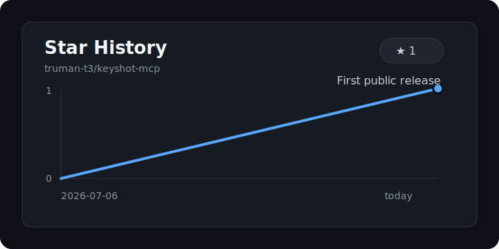

# KeyShot MCP

English | [中文](#中文说明)

A local MCP server for controlling KeyShot Studio through KeyShot headless scripting.

It lets an AI app that supports MCP ask KeyShot to inspect scenes, render images, import models, change materials, adjust cameras, set environments, and save scenes.

## Who This Is For

- Designers who want AI-assisted KeyShot rendering.
- Developers who want a simple stdio MCP bridge for KeyShot.
- Teams that already have KeyShot licenses configured on their machines.

This project does not include KeyShot, does not bypass licensing, and does not store license keys.

## What It Can Do

- Check whether KeyShot headless can start.
- Inspect a `.bip` or supported KeyShot scene file.
- Render a scene to an image.
- Import a model into a scene.
- Apply a material to an object.
- Create or update a camera.
- Set an environment when the installed KeyShot version exposes that function.
- Save a scene to a new file.

## Example Workflows

- Batch render multiple camera views from one KeyShot scene.
- Test several material options on the same product model.
- Generate product hero images with consistent resolution and output naming.
- Import a model, apply a material preset, set a camera, and render in one AI instruction.

## Workflow


## Requirements

- KeyShot Studio with `keyshot_headless` support.
- Node.js 20 or newer.
- A valid KeyShot license already configured on the computer.

## Compatibility

| Platform | KeyShot Version | Node Version | Status |
| --- | --- | --- | --- |
| Windows 11 | KeyShot Studio 2025 / 14.1 | Node 22 | Tested |
| macOS | Not tested | - | Need contributors |
| Linux | Not tested | - | Need contributors |

## Install

```bash
npm install
npm run build
```

## Configure

Set the path to your KeyShot headless executable.

Windows PowerShell example:

```powershell
$env:KEYSHOT_HEADLESS_EXE="C:\Program Files\KeyShot Studio\bin\keyshot_headless.exe"
```

macOS/Linux shell example:

```bash
export KEYSHOT_HEADLESS_EXE="/Applications/KeyShot Studio.app/Contents/MacOS/keyshot_headless"
```

Then test startup:

```bash
npm run status
```

## MCP Client Example

Add a server like this to your MCP client config:

```json
{
  "mcpServers": {
    "keyshot": {
      "command": "node",
      "args": ["/absolute/path/to/keyshot-mcp/dist/index.js"],
      "env": {
        "KEYSHOT_HEADLESS_EXE": "/absolute/path/to/keyshot_headless"
      }
    }
  }
}
```

For this computer, a ready-to-use Codex example is in:

```text
examples/codex-local.example.json
```

## Codex Configuration

For Codex, add a `keyshot` MCP server entry to your Codex MCP configuration and point it to the built server file:

```json
{
  "mcpServers": {
    "keyshot": {
      "command": "node",
      "args": ["/absolute/path/to/keyshot-mcp/dist/index.js"],
      "env": {
        "KEYSHOT_HEADLESS_EXE": "/absolute/path/to/keyshot_headless"
      }
    }
  }
}
```

Use `examples/codex-local.example.json` only as a local reference. Replace all paths with paths on your own computer.

## Environment Variables

- `KEYSHOT_HEADLESS_EXE`: path to `keyshot_headless` or `keyshot_headless.exe`.
- `KEYSHOT_OUTPUT_DIR`: default output folder for renders.
- `KEYSHOT_LICENSE_ARGS`: optional KeyShot headless license arguments. Empty by default.
- `KEYSHOT_TIMEOUT_MS`: operation timeout in milliseconds. Default: `600000`.

## MCP Tools

- `keyshot_status`
- `keyshot_inspect_scene`
- `keyshot_render`
- `keyshot_import_model`
- `keyshot_apply_material`
- `keyshot_set_camera`
- `keyshot_set_environment`
- `keyshot_save_scene`

Each tool returns JSON with:

- `ok`
- `data`
- `outputFiles`
- `warnings`
- `keyshotStdoutTail`
- `error`

## Notes

KeyShot's Python `lux` API changes across versions. This server keeps the MCP interface stable and returns a clear error when an installed KeyShot version does not expose a requested headless function.

## License

MIT

---

# 中文说明

[English](#keyshot-mcp) | 中文

这是一个本地 KeyShot MCP 服务，可以让支持 MCP 的 AI 工具通过 KeyShot 的无界面脚本能力控制 KeyShot Studio。

简单说：你可以让 AI 帮你检查 KeyShot 场景、渲染图片、导入模型、替换材质、调整相机、设置环境并保存场景。

## 适合谁使用

- 希望用 AI 辅助 KeyShot 渲染的设计师。
- 想要 KeyShot MCP 桥接工具的开发者。
- 已经在电脑上配置好 KeyShot 授权的团队。

这个项目不包含 KeyShot，不绕过 KeyShot 授权，也不会保存许可证密钥。

## 能做什么

- 检查 KeyShot 无界面程序是否能启动。
- 检查 `.bip` 或 KeyShot 支持的场景文件。
- 把场景渲染成图片。
- 把模型导入场景。
- 给对象替换材质。
- 创建或更新相机。
- 在当前 KeyShot 版本支持时设置环境。
- 把场景保存为新文件。

## 典型使用场景

- 批量渲染同一个 KeyShot 场景的多个相机视角。
- 对同一个产品模型快速测试多组材质方案。
- 统一输出产品首图、封面图、详情页渲染图。
- 用一句自然语言完成导入模型、替换材质、设置相机、渲染出图。

## 工作流程


## 使用要求

- 已安装支持 `keyshot_headless` 的 KeyShot Studio。
- Node.js 20 或更新版本。
- 电脑上已经配置好有效的 KeyShot 授权。

## 版本兼容表

| 平台 | KeyShot 版本 | Node 版本 | 状态 |
| --- | --- | --- | --- |
| Windows 11 | KeyShot Studio 2025 / 14.1 | Node 22 | 已测试 |
| macOS | 未测试 | - | 需要贡献者 |
| Linux | 未测试 | - | 需要贡献者 |

## 安装

```bash
npm install
npm run build
```

## 配置

需要告诉 MCP 服务 KeyShot 无界面程序在哪里。

Windows PowerShell 示例：

```powershell
$env:KEYSHOT_HEADLESS_EXE="C:\Program Files\KeyShot Studio\bin\keyshot_headless.exe"
```

macOS/Linux 示例：

```bash
export KEYSHOT_HEADLESS_EXE="/Applications/KeyShot Studio.app/Contents/MacOS/keyshot_headless"
```

然后测试能否启动：

```bash
npm run status
```

## MCP 客户端配置示例

把类似下面的配置加到你的 MCP 客户端里：

```json
{
  "mcpServers": {
    "keyshot": {
      "command": "node",
      "args": ["/absolute/path/to/keyshot-mcp/dist/index.js"],
      "env": {
        "KEYSHOT_HEADLESS_EXE": "/absolute/path/to/keyshot_headless"
      }
    }
  }
}
```

这台电脑可直接使用的 Codex 示例在：

```text
examples/codex-local.example.json
```

## Codex 配置

如果你使用 Codex，请在 Codex 的 MCP 配置里添加一个 `keyshot` 服务，并指向构建后的服务文件：

```json
{
  "mcpServers": {
    "keyshot": {
      "command": "node",
      "args": ["/absolute/path/to/keyshot-mcp/dist/index.js"],
      "env": {
        "KEYSHOT_HEADLESS_EXE": "/absolute/path/to/keyshot_headless"
      }
    }
  }
}
```

`examples/codex-local.example.json` 只是本机配置参考。其他用户需要把里面的路径换成自己电脑上的路径。

## 环境变量

- `KEYSHOT_HEADLESS_EXE`：`keyshot_headless` 或 `keyshot_headless.exe` 的路径。
- `KEYSHOT_OUTPUT_DIR`：默认渲染输出文件夹。
- `KEYSHOT_LICENSE_ARGS`：可选的 KeyShot 无界面许可证参数，默认留空。
- `KEYSHOT_TIMEOUT_MS`：单次操作超时时间，单位毫秒，默认 `600000`。

## MCP 工具

- `keyshot_status`：检查 KeyShot 是否能启动。
- `keyshot_inspect_scene`：检查场景内容。
- `keyshot_render`：渲染图片。
- `keyshot_import_model`：导入模型。
- `keyshot_apply_material`：替换材质。
- `keyshot_set_camera`：设置相机。
- `keyshot_set_environment`：设置环境。
- `keyshot_save_scene`：保存场景。

每个工具都会返回 JSON，包含：

- `ok`：是否成功。
- `data`：主要结果。
- `outputFiles`：生成的文件。
- `warnings`：警告信息。
- `keyshotStdoutTail`：KeyShot 输出摘要。
- `error`：错误信息。

## 说明

KeyShot 的 Python `lux` API 会随版本变化。这个 MCP 会尽量保持对外工具名称稳定；如果当前 KeyShot 版本不支持某个无界面功能，会返回明确错误，而不是假装成功。

## 开源协议

MIT

## Star History / 星标趋势


