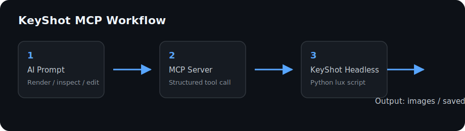
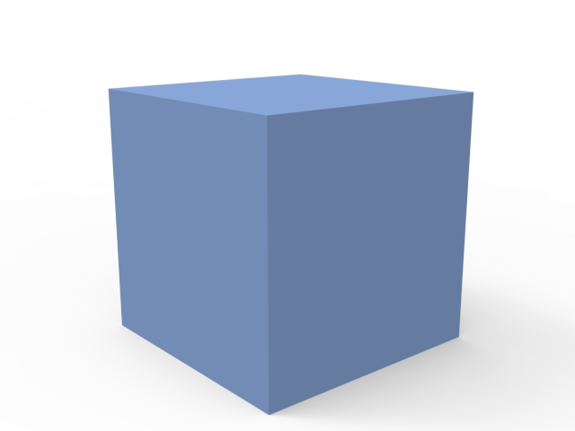

# KeyShot MCP

[](https://www.npmjs.com/package/keyshot-mcp)
[](https://github.com/truman-t3/keyshot-mcp/actions/workflows/ci.yml)
[](LICENSE)

[English](#english) | [中文](#中文)

KeyShot MCP is a local [Model Context Protocol](https://modelcontextprotocol.io/)
server for inspecting, editing, and rendering KeyShot scenes through KeyShot
headless scripting. It lets an MCP-compatible AI agent perform repeatable product
visualization tasks while scenes, models, licenses, and rendered files remain on
the local computer.



## English

### What it can do

- Inspect scene objects, materials, cameras, model sets, and external references.
- Import models and optionally center them, place them on the ground, update the
  camera target, and adjust the environment.
- Render one camera, selected cameras, every camera in a scene, or a sequential
  render queue.
- Create and update cameras by position, look-at point, distance, field of view,
  focal length, or reusable presets.
- Apply materials directly or through a local material preset library.
- Select environments, change brightness, and rotate the active environment.
- Save edited scenes to a controlled output directory.
- Prepare and render a product from a model or existing scene in one tool call.

### Requirements and compatibility

- Node.js 20 or newer.
- A locally installed and licensed KeyShot version with headless scripting.
- Windows 11 with KeyShot Studio 2025 / KeyShot 14.1 is tested.
- Other KeyShot versions may work when they expose the same official scripting
  APIs, but they are not currently verified by this project.
- KeyShot and its license are not included.

### Install

The current release is `0.8.0`.

#### Option 1: run with npx

This requires no global npm installation:

```json
{
  "mcpServers": {
    "keyshot": {
      "command": "npx",
      "args": ["-y", "keyshot-mcp@0.8.0"],
      "env": {
        "KEYSHOT_HEADLESS_EXE": "C:/Program Files/KeyShot Studio/bin/keyshot_headless.exe"
      }
    }
  }
}
```

#### Option 2: install globally

```bash
npm install -g keyshot-mcp@0.8.0
```

```json
{
  "mcpServers": {
    "keyshot": {
      "command": "keyshot-mcp",
      "env": {
        "KEYSHOT_HEADLESS_EXE": "C:/Program Files/KeyShot Studio/bin/keyshot_headless.exe"
      }
    }
  }
}
```

#### Option 3: run from source

```bash
git clone https://github.com/truman-t3/keyshot-mcp.git
cd keyshot-mcp
pnpm install
pnpm build
```

Configure the MCP client to run the absolute path to `dist/index.js`:

```json
{
  "mcpServers": {
    "keyshot": {
      "command": "node",
      "args": ["C:/absolute/path/to/keyshot-mcp/dist/index.js"],
      "env": {
        "KEYSHOT_HEADLESS_EXE": "C:/Program Files/KeyShot Studio/bin/keyshot_headless.exe"
      }
    }
  }
}
```

Restart the MCP client after changing its configuration.

### Agent installation prompt

The following prompt can be pasted into a coding agent that is allowed to edit
the MCP client configuration:

```text
Install KeyShot MCP 0.8.0 and configure it in my MCP client.

1. Find the local KeyShot headless executable.
2. Add an MCP server named "keyshot" that runs:
   npx -y keyshot-mcp@0.8.0
3. Set KEYSHOT_HEADLESS_EXE to the executable path.
4. Keep KEYSHOT_ALLOW_EXTERNAL_OUTPUTS disabled.
5. Restart or reload the MCP client, call keyshot_status, then use keyshot_product_render for a one-click product render.
6. Do not upload or publish any KeyShot scenes, models, renders, or license data.
```

### Configuration

| Variable | Default | Purpose |
| --- | --- | --- |
| `KEYSHOT_HEADLESS_EXE` | `keyshot_headless.exe` on Windows | Absolute executable path or a command available on `PATH`. |
| `KEYSHOT_OUTPUT_DIR` | Package-local `outputs` | Root directory for rendered images and saved scenes. |
| `KEYSHOT_ALLOW_EXTERNAL_OUTPUTS` | `false` | Allows output paths outside `KEYSHOT_OUTPUT_DIR` when explicitly set to `true`. |
| `KEYSHOT_TIMEOUT_MS` | `600000` | Timeout for one KeyShot headless process. |
| `KEYSHOT_LICENSE_ARGS` | empty | Optional additional KeyShot launch arguments. |
| `KEYSHOT_MATERIAL_PRESETS` | Built-in `presets/materials.json` | Path to a user-managed material preset file. |
| `KEYSHOT_CAMERA_PRESETS` | Built-in `presets/cameras.json` | Path to a user-managed camera preset file. |

Relative output paths are resolved inside `KEYSHOT_OUTPUT_DIR`. Parent traversal,
adjacent-prefix paths, and symbolic-link escapes are rejected by default. Input
scene, model, material, and environment paths may be located elsewhere.

### Tools

| Tool | Purpose |
| --- | --- |
| `keyshot_status` | Verify that KeyShot headless can start and report its version. |
| `keyshot_product_render` | Prepare, save, and render a model or existing scene in one headless process. |
| `keyshot_inspect_scene` | Inspect objects, cameras, materials, model sets, and references. |
| `keyshot_list_cameras` | List available camera names. |
| `keyshot_render` | Render one image. |
| `keyshot_render_queue` | Run independent render jobs sequentially. |
| `keyshot_batch_render` | Render a supplied list of named cameras from one scene. |
| `keyshot_render_all_cameras` | Discover and render every camera in one scene. |
| `keyshot_import_model` | Import a model with optional composition adjustments. |
| `keyshot_apply_material` | Apply a library material or material file. |
| `keyshot_list_material_presets` | List local material presets. |
| `keyshot_apply_material_preset` | Apply a named material preset. |
| `keyshot_set_camera` | Create or update camera transform, distance, FOV, or focal length. |
| `keyshot_list_camera_presets` | List standard and custom camera presets. |
| `keyshot_apply_camera_preset` | Apply a standard or absolute-coordinate camera preset. |
| `keyshot_set_environment` | Select or adjust an environment, brightness, or rotation. |
| `keyshot_save_scene` | Save a scene to a new output path. |

The server exposes 17 tools, a `keyshot_product_render` MCP prompt, and a
`keyshot://workflow` resource.

### One-click product render

In an MCP client, a designer can use a natural-language request:

```text
Turn C:\models\speaker.obj into a product render. Center it, place it on the
ground, use the Isometric camera preset, save the KeyShot scene, and render a
1600 x 1200 PNG with 128 samples.
```

The `keyshot_product_render` tool accepts either `modelPath` or `scenePath`. New
models default to centered and grounded geometry with a `Product Hero`
isometric camera. Existing scenes keep their current camera, materials, and
environment unless explicit changes are requested.

```json
{
  "modelPath": "C:/models/speaker.obj",
  "outputScenePath": "speaker-product.bip",
  "outputPath": "speaker-product.png",
  "materialAssignments": [
    { "objectName": "Body", "presetName": "Brushed Steel" }
  ],
  "cameraPresetName": "Isometric",
  "focalLength": 55,
  "brightness": 1.2,
  "rotation": 45,
  "width": 1600,
  "height": 1200,
  "samples": 128
}
```

Use `renderMode: "allCameras"` with `outputDir` to render every named camera.
Generated names are derived from the source filename when output paths are
omitted. Existing files are protected by default; set `overwrite: true` only
when replacement is intentional. Material assignments always require an
explicit object and never overwrite the entire model implicitly.

### Product composition examples

Import a model and prepare its initial composition:

```text
Import C:\models\speaker.obj into KeyShot. Center the geometry, place it on the
ground, update the camera look-at point and environment, then save the scene as
speaker-prepared.bip.
```

The corresponding `keyshot_import_model` options are:

```json
{
  "centerGeometry": true,
  "snapToGround": true,
  "adjustCameraLookAt": true,
  "adjustEnvironment": true
}
```

Create a product camera with one lens control:

```text
Set the Product Hero camera to a 55 mm focal length and distance 6, save a new
scene, then render a PNG preview.
```

`fieldOfView` must be greater than `0` and less than `180`. `focalLength` accepts
`5` to `200` mm. The two controls are mutually exclusive. `position` and
`lookAt` are optional, but must be supplied together when changing the transform.

Rotate the active HDRI or environment:

```text
Rotate the current KeyShot environment to 45 degrees, save the edited scene,
and render all cameras.
```

`rotation` accepts values from `0` inclusive to `360` exclusive.

For rendering, `samples` and `maxTimeSeconds` select different KeyShot render
modes and cannot be supplied together.

### Camera and material presets

The built-in camera library includes Front, Back, Left, Right, Top, Bottom, and
Isometric views. A custom `KEYSHOT_CAMERA_PRESETS` JSON file may contain standard
views or absolute `position`, `lookAt`, and optional `up` vectors.

Material presets are stored in JSON and reference KeyShot library material names
or local material files. The MCP server reads preset files but does not modify
them.

### Reproducible KeyShot smoke test

The repository includes a smoke test built from generated cube geometry in
`examples/demo`. It verifies startup, import composition, scene inspection,
camera presets, focal length, field of view, camera distance, environment
rotation, scene saving, camera discovery, one-click model rendering, one-click
existing-scene rendering, and real PNG output:

```bash
npm run smoke:keyshot
```

Generated `.bip` files and test renders remain in the configured local output
directory. The repository includes one representative result:



### Development and tests

```bash
pnpm install
pnpm check
pnpm test
python -m unittest discover -s tests -p "test_*.py"
npm pack --dry-run
```

CI runs on Windows and Ubuntu with Node.js 20 and 24. Linux CI validates the MCP
server, bridge logic, and package; it does not claim that KeyShot itself runs on
Linux.

### Roadmap

- Verify additional KeyShot releases on real installations.
- Verify macOS installation and headless behavior.
- Add depth-of-field and additional lens controls when stable headless APIs are
  available.

### License and security

Released under the [MIT License](LICENSE). See [SECURITY.md](SECURITY.md) for
security guidance and [CONTRIBUTING.md](CONTRIBUTING.md) for development notes.
Do not commit KeyShot licenses, private scenes, customer assets, or unpublished
renders.

### Trademark and project status

KeyShot is a trademark of KeyShot ApS and/or KeyShot Inc. This is an independent,
open-source community project and is not affiliated with, endorsed by, or
sponsored by KeyShot.

This project provides only an MCP integration. It does not include KeyShot
Studio, KeyShot assets, or a KeyShot license. Users must install and license
KeyShot Studio separately and comply with the applicable KeyShot terms. Do not
use this project to bypass licensing, share credentials, or redistribute KeyShot
software or proprietary resources.

---

## 中文

KeyShot MCP 是一个本地运行的
[Model Context Protocol](https://modelcontextprotocol.io/) 服务，通过 KeyShot
headless 脚本让兼容 MCP 的 AI Agent 检查、编辑和渲染 KeyShot 场景。场景、模型、
许可证和渲染文件均保留在本机。

### 主要功能

- 检查场景对象、材质、相机、模型集和外部引用。
- 导入模型，并可选择自动居中、贴地、调整相机观察点和环境。
- 渲染单个相机、指定相机、场景中的全部相机或顺序渲染队列。
- 通过位置、观察点、距离、视野角、焦距或预设创建和更新相机。
- 直接应用材质，或使用本地材质预设库。
- 选择环境、调整亮度并旋转当前环境。
- 将修改后的场景保存到受控输出目录。
- 通过一次工具调用完成模型或现有场景的产品构图与渲染。

### 运行要求与兼容性

- Node.js 20 或更高版本。
- 本机已安装并获得许可、且支持 headless 脚本的 KeyShot。
- 已实测：Windows 11、KeyShot Studio 2025 / KeyShot 14.1。
- 其他 KeyShot 版本在提供相同官方脚本 API 时可能兼容，但本项目尚未完成实机验证。
- 本项目不包含 KeyShot 软件或许可证。

### 安装

当前版本为 `0.8.0`。

#### 方式一：使用 npx

无需全局安装 npm 包：

```json
{
  "mcpServers": {
    "keyshot": {
      "command": "npx",
      "args": ["-y", "keyshot-mcp@0.8.0"],
      "env": {
        "KEYSHOT_HEADLESS_EXE": "C:/Program Files/KeyShot Studio/bin/keyshot_headless.exe"
      }
    }
  }
}
```

#### 方式二：全局安装

```bash
npm install -g keyshot-mcp@0.8.0
```

```json
{
  "mcpServers": {
    "keyshot": {
      "command": "keyshot-mcp",
      "env": {
        "KEYSHOT_HEADLESS_EXE": "C:/Program Files/KeyShot Studio/bin/keyshot_headless.exe"
      }
    }
  }
}
```

#### 方式三：从源码运行

```bash
git clone https://github.com/truman-t3/keyshot-mcp.git
cd keyshot-mcp
pnpm install
pnpm build
```

将 MCP 客户端配置为运行 `dist/index.js` 的绝对路径：

```json
{
  "mcpServers": {
    "keyshot": {
      "command": "node",
      "args": ["C:/absolute/path/to/keyshot-mcp/dist/index.js"],
      "env": {
        "KEYSHOT_HEADLESS_EXE": "C:/Program Files/KeyShot Studio/bin/keyshot_headless.exe"
      }
    }
  }
}
```

修改配置后请重启或重新加载 MCP 客户端。

### 复制给 Agent 的安装提示词

下面的提示词适用于有权限修改 MCP 客户端配置的编程 Agent：

```text
请帮我安装 KeyShot MCP 0.8.0，并添加到我的 MCP 客户端。

1. 查找本机 KeyShot headless 可执行文件。
2. 添加名为 keyshot 的 MCP server，运行：
   npx -y keyshot-mcp@0.8.0
3. 将 KEYSHOT_HEADLESS_EXE 设置为可执行文件路径。
4. 保持 KEYSHOT_ALLOW_EXTERNAL_OUTPUTS 关闭。
5. 重启或重新加载 MCP 客户端，调用 keyshot_status，然后使用 keyshot_product_render 一键完成产品出图。
6. 不要上传或发布任何 KeyShot 场景、模型、渲染图或许可证数据。
```

### 配置项

| 环境变量 | 默认值 | 用途 |
| --- | --- | --- |
| `KEYSHOT_HEADLESS_EXE` | Windows 上为 `keyshot_headless.exe` | KeyShot headless 绝对路径，或系统 `PATH` 中的命令。 |
| `KEYSHOT_OUTPUT_DIR` | 包内 `outputs` | 渲染图和已保存场景的根目录。 |
| `KEYSHOT_ALLOW_EXTERNAL_OUTPUTS` | `false` | 明确设为 `true` 时允许写入输出根目录之外。 |
| `KEYSHOT_TIMEOUT_MS` | `600000` | 单个 KeyShot headless 进程的超时时间。 |
| `KEYSHOT_LICENSE_ARGS` | 空 | 可选的 KeyShot 启动参数。 |
| `KEYSHOT_MATERIAL_PRESETS` | 内置 `presets/materials.json` | 自定义材质预设 JSON 路径。 |
| `KEYSHOT_CAMERA_PRESETS` | 内置 `presets/cameras.json` | 自定义相机预设 JSON 路径。 |

相对输出路径会自动放入 `KEYSHOT_OUTPUT_DIR`。默认拒绝 `..`、相邻同名前缀目录和
软链接逃逸。输入场景、模型、材质和环境文件可位于其他目录。

### MCP 工具

| 工具 | 用途 |
| --- | --- |
| `keyshot_status` | 检查 KeyShot headless 是否可启动并读取版本。 |
| `keyshot_product_render` | 在一个 headless 进程中完成模型或场景准备、保存和渲染。 |
| `keyshot_inspect_scene` | 检查对象、相机、材质、模型集和外部引用。 |
| `keyshot_list_cameras` | 列出场景中的相机名称。 |
| `keyshot_render` | 渲染一张图片。 |
| `keyshot_render_queue` | 顺序执行多个独立渲染任务。 |
| `keyshot_batch_render` | 渲染用户指定的一组相机。 |
| `keyshot_render_all_cameras` | 自动发现并渲染场景中的全部相机。 |
| `keyshot_import_model` | 导入模型并可选择自动构图。 |
| `keyshot_apply_material` | 应用材质库名称或材质文件。 |
| `keyshot_list_material_presets` | 列出本地材质预设。 |
| `keyshot_apply_material_preset` | 应用指定材质预设。 |
| `keyshot_set_camera` | 创建或更新相机变换、距离、视野角或焦距。 |
| `keyshot_list_camera_presets` | 列出标准和自定义相机预设。 |
| `keyshot_apply_camera_preset` | 应用标准视角或绝对坐标相机预设。 |
| `keyshot_set_environment` | 选择环境并调整亮度或旋转角度。 |
| `keyshot_save_scene` | 将场景保存到新的输出路径。 |

服务共提供 17 个工具，并提供 `keyshot_product_render` MCP 提示词和
`keyshot://workflow` 资源。

### 一键产品出图

设计师可以直接在支持 MCP 的 Agent 中描述需求：

```text
把 C:\models\speaker.obj 做成产品渲染图。自动居中、贴地，使用 Isometric
相机预设，保存 KeyShot 场景，并用 128 采样渲染一张 1600 x 1200 PNG。
```

`keyshot_product_render` 可以接收 `modelPath` 或 `scenePath`。新模型默认自动居中、
贴地并创建名为 `Product Hero` 的等轴测相机；已有场景默认保留当前相机、材质和环境，
只有明确提供参数时才修改。

```json
{
  "modelPath": "C:/models/speaker.obj",
  "outputScenePath": "speaker-product.bip",
  "outputPath": "speaker-product.png",
  "materialAssignments": [
    { "objectName": "Body", "presetName": "Brushed Steel" }
  ],
  "cameraPresetName": "Isometric",
  "focalLength": 55,
  "brightness": 1.2,
  "rotation": 45,
  "width": 1600,
  "height": 1200,
  "samples": 128
}
```

将 `renderMode` 设为 `allCameras` 并提供 `outputDir`，即可渲染场景中的全部命名相机。
省略输出路径时会根据源文件名自动生成。默认不会覆盖已有文件，只有明确设置
`overwrite: true` 才会替换。材质指定必须包含明确的对象，不会隐式覆盖整个模型。

### 产品构图示例

导入模型并完成初始构图：

```text
把 C:\models\speaker.obj 导入 KeyShot，自动居中、贴地、调整相机观察点和环境，
然后保存为 speaker-prepared.bip。
```

对应的 `keyshot_import_model` 参数：

```json
{
  "centerGeometry": true,
  "snapToGround": true,
  "adjustCameraLookAt": true,
  "adjustEnvironment": true
}
```

设置产品相机：

```text
把 Product Hero 相机设为 55 mm 焦距、距离 6，保存新场景并渲染 PNG 预览图。
```

`fieldOfView` 必须大于 `0` 且小于 `180`；`focalLength` 支持 `5–200 mm`，
两者不能同时使用。`position` 和 `lookAt` 可不填写，但修改相机位置时必须成对提供。

旋转当前 HDRI 或环境：

```text
把当前 KeyShot 环境旋转到 45 度，保存场景，然后渲染全部相机。
```

`rotation` 支持大于等于 `0` 且小于 `360` 的数值。

渲染参数 `samples` 和 `maxTimeSeconds` 对应不同的 KeyShot 渲染模式，不能同时使用。

### 相机与材质预设

内置相机库包含 Front、Back、Left、Right、Top、Bottom 和 Isometric 七个标准视角。
自定义 `KEYSHOT_CAMERA_PRESETS` JSON 可使用标准视角，也可提供绝对 `position`、
`lookAt` 和可选 `up` 向量。

材质预设通过 JSON 引用 KeyShot 材质库名称或本地材质文件。MCP 只读取预设文件，
不会自动修改它们。

### 可复现的 KeyShot smoke test

仓库提供基于 `examples/demo` 生成立方体几何体的 smoke test，用于验证 KeyShot
启动、导入构图、场景检查、相机预设、焦距、视野角、相机距离、环境旋转、场景保存、
相机发现、模型一键出图、现有场景一键渲染全部相机和真实 PNG 输出：

```bash
npm run smoke:keyshot
```

生成的 `.bip` 和测试渲染图只保留在配置的本地输出目录。仓库中包含一张代表性结果：


### 开发与测试

```bash
pnpm install
pnpm check
pnpm test
python -m unittest discover -s tests -p "test_*.py"
npm pack --dry-run
```

CI 在 Windows 和 Ubuntu 上使用 Node.js 20、24 运行。Linux CI 验证 MCP 服务、
桥接逻辑和 npm 包，不代表 KeyShot 软件已在 Linux 上通过实机测试。

### 路线图

- 在更多 KeyShot 正式版本上完成实机验证。
- 验证 macOS 安装和 headless 行为。
- 在 headless API 稳定支持后增加景深和更多镜头控制。

### 许可证与安全

项目采用 [MIT License](LICENSE)。安全说明见 [SECURITY.md](SECURITY.md)，开发说明
见 [CONTRIBUTING.md](CONTRIBUTING.md)。请勿提交 KeyShot 许可证、私有场景、客户素材
或未公开渲染图。

### 商标与项目性质

KeyShot 是 KeyShot ApS 和/或 KeyShot Inc. 的商标。本项目是独立的开源社区项目，
与 KeyShot 官方无隶属、认可、赞助或其他合作关系。

本项目仅提供 MCP 集成功能，不包含 KeyShot Studio、KeyShot 官方素材或 KeyShot
许可证。用户必须自行安装并合法授权 KeyShot Studio，同时遵守适用的 KeyShot 条款。
不得使用本项目绕过许可证、共享账号凭据，或重新分发 KeyShot 软件及其专有资源。
