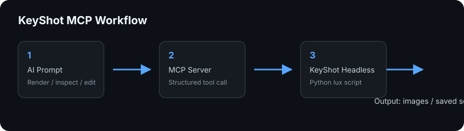
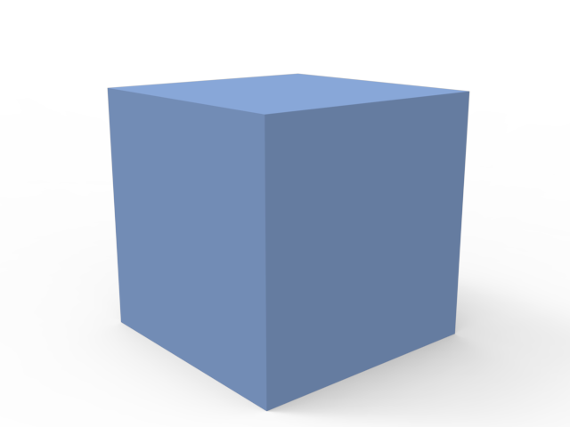

<p align="center">
  
</p>

<p align="center"><strong>Turn product-rendering requests into safe, repeatable KeyShot workflows.</strong></p>

<p align="center">
  Inspect scenes, prepare product views, adjust materials, cameras and environments,
  and return Agent-visible renders through local KeyShot headless scripting.
</p>

<p align="center">
  <a href="https://www.npmjs.com/package/keyshot-mcp"></a>
  <a href="https://github.com/truman-t3/keyshot-mcp/actions/workflows/ci.yml"></a>
  <a href="LICENSE"></a>
  
</p>

<p align="center">
  <a href="#quick-start-for-designers">Quick start</a> ·
  <a href="#highlights">Highlights</a> ·
  <a href="#common-workflows">Workflows</a> ·
  <a href="#tools">Tools</a> ·
  <a href="#configuration">Configuration</a>
</p>

<p align="center"><a href="#english">English</a> · <a href="#中文">简体中文</a></p>

<p align="center">
  <strong>Useful for your KeyShot workflow? Star the repository to help other designers discover it.</strong><br>
  <strong>如果它改善了你的 KeyShot 工作流，欢迎点一个 Star，让更多设计师发现这个项目。</strong>
</p>

KeyShot MCP connects an MCP-compatible AI agent to a licensed KeyShot installation
on the same computer. KeyShot file processing stays local; however, an MCP client
may send tool results, scene metadata, or embedded previews to its configured model
provider. See [Security](SECURITY.md) before using confidential work.



## English

### Highlights

- **Start with a request, not a render-settings checklist.** Use one product tool
  for model import, object materials, camera, environment, scene copy, and output.
- **See before committing.** Bounded PNG previews are returned directly to the
  Agent for composition, material, and lighting feedback.
- **Keep source scenes protected.** Editing workflows write controlled copies and
  reject output paths outside the configured safe directory by default.
- **Continue from the latest save.** Saved-scene sync detects real file changes,
  creates a collision-safe copy, and avoids duplicate work with fingerprints.
- **Use focused controls when needed.** Nineteen documented tools cover inspection,
  presets, cameras, materials, environments, render queues, and all-camera output.

> [!NOTE]
> Tested on Windows 11 with KeyShot Studio 2025 / KeyShot 14.1. KeyShot and a valid
> license are required and are not included with this independent project.

### Quick start for designers

The easiest setup is to send this prompt to an agent that can edit your MCP
configuration:

```text
Install KeyShot MCP 0.11.0 and configure it in my MCP client.

1. Use: npx -y keyshot-mcp@0.11.0
2. Find my local keyshot_headless.exe and set KEYSHOT_HEADLESS_EXE to its full path.
3. Keep outputs in the default KeyShot MCP Outputs folder unless I choose another safe folder.
4. Keep KEYSHOT_ALLOW_EXTERNAL_OUTPUTS disabled.
5. Restart or reload the MCP client and run keyshot_status.
6. Explain any problem and its suggested fix in plain language.
7. Do not upload or publish my KeyShot files, persistent renders, or license information.
8. Before sending a preview image to the configured model provider, remind me when the scene is confidential.
```

After setup, try:

```text
Check whether KeyShot MCP is ready, then prepare a standard-quality product render
from C:\models\speaker.obj.
```

### Requirements

- Node.js 20 or newer.
- A locally installed and licensed KeyShot edition with headless scripting.
- Windows 11 with KeyShot Studio 2025 / KeyShot 14.1 is tested.
- Other KeyShot versions may work when they expose the same scripting APIs, but
  they are not currently verified by this project.
- KeyShot, its license, materials, and environments are not included.

### Why the stable release does not control the open KeyShot window

The stable server works on saved scene files through KeyShot headless scripting;
it does not control the currently open, unsaved KeyShot GUI session. This is a
boundary of the public KeyShot scripting execution model, not an omitted MCP
connection. KeyShot's Script Runner keeps a GUI script active until that script
returns. In our Live Companion prototype, keeping a bridge alive also kept the
Script Runner open and blocked normal interaction with the KeyShot window.

Calling `lux.sync()` can flush pending KeyShot operations, but it does not provide
a documented background service, GUI event callback, or plugin lifecycle that can
safely host a persistent MCP bridge. Calling `lux` from an arbitrary worker thread
would also risk unsafe access to the scene. For that reason, the project does not
present the experimental bridge as production-ready realtime control.

For a reliable workflow, save the scene first. The Agent can inspect or edit a
safe copy through headless KeyShot, return a preview, and preserve the original
file. True realtime GUI control can be reconsidered if KeyShot exposes a supported
non-blocking GUI extension or main-thread callback API.

Use `keyshot_sync_saved_scene` for the closest stable alternative to realtime
collaboration. Give it a saved `.bip` file or one folder containing `.bip` files.
It selects the newest saved scene, computes a content fingerprint, copies it to a
collision-safe output name, and returns an embedded preview by default. Pass the
returned fingerprint on the next call; if the user has not saved a new change,
the tool reports `changed: false` without creating another copy or render.

```text
I saved my KeyShot scene in C:\projects\speaker. Sync the newest .bip from that
folder, show me a preview, and do not overwrite the original scene.
```

### Install

The current release is `0.11.0`.

#### Run with npx

No global npm installation is required:

```json
{
  "mcpServers": {
    "keyshot": {
      "command": "npx",
      "args": ["-y", "keyshot-mcp@0.11.0"],
      "env": {
        "KEYSHOT_HEADLESS_EXE": "C:/Program Files/KeyShot Studio/bin/keyshot_headless.exe"
      }
    }
  }
}
```

#### Install globally

```bash
npm install -g keyshot-mcp@0.11.0
```

```json
{
  "mcpServers": {
    "keyshot": {
      "command": "keyshot-mcp",
      "env": {
        "KEYSHOT_HEADLESS_EXE": "C:/Program Files/KeyShot Studio/bin/keyshot_headless.exe"
      }
    }
  }
}
```

#### Run from source

```bash
git clone https://github.com/truman-t3/keyshot-mcp.git
cd keyshot-mcp
pnpm install
pnpm build
```

Point the MCP client to the absolute path of `dist/index.js`. Ready-to-edit examples
are available in [`examples`](examples).

Restart the MCP client after changing its configuration, then call
`keyshot_status`. The status result checks the MCP version, KeyShot executable,
output access, bridge files, preset JSON, and a minimal KeyShot startup.

### Common workflows

#### Preview before final rendering

Use `keyshot_preview_render` after checking a scene. It returns a PNG directly to
the Agent, so composition, materials, and lighting can be described and confirmed
before a standard or final render. Temporary previews are deleted automatically;
set `outputPath` only when a persistent PNG copy is needed.

Recommended loop: status check -> scene inspection -> preview -> Agent feedback ->
user confirmation -> standard or final render.

#### One-call product render

`keyshot_product_render` is the recommended high-level tool for ordinary product
work. It can import a model or open a scene, apply object-specific materials,
configure a camera and environment, save a scene copy, and render in one KeyShot
process.

```text
Import C:\models\speaker.obj, center and ground it, use the Isometric camera preset,
set a 55 mm focal length, save a scene copy, and render a standard PNG.
```

For a new model, import composition options default to enabled. Existing scenes
keep their current composition unless explicit changes are requested.

#### Render every camera

```text
Render every saved camera in C:\scenes\speaker.bip at preview quality. Continue if
one camera fails and do not overwrite existing images.
```

Use `keyshot_batch_render` instead when only selected named cameras are required.

#### Prepare a model without rendering

```text
Import C:\models\speaker.obj, center it, place it on the ground, adjust the camera
target and environment, then save speaker-prepared.bip.
```

#### Adjust camera and environment

```text
Set the Product Hero camera to a 55 mm focal length and distance 6, rotate the
current environment to 45 degrees, save a new scene, then render a preview.
```

`fieldOfView` and `focalLength` cannot be used together. `position` and `lookAt`
are optional, but must be supplied as a pair. `samples` and `maxTimeSeconds` select
different KeyShot render modes and cannot be combined.

### Quality presets

| Preset     |  Resolution | Samples | Use                                  |
| ---------- | ----------: | ------: | ------------------------------------ |
| `preview`  |   960 x 540 |      16 | Fast composition and material checks |
| `standard` | 1920 x 1080 |      64 | Default for `keyshot_product_render` |
| `final`    | 3840 x 2160 |     256 | High-resolution final output         |

Explicit `width`, `height`, and `samples` override the corresponding preset values.
Explicit `maxTimeSeconds` switches to time-based rendering instead of preset samples.
Lower-level render tools preserve their existing behavior when no preset is given.

### Tools

| Tool                            | Purpose                                                                       |
| ------------------------------- | ----------------------------------------------------------------------------- |
| `keyshot_status`                | Diagnose local configuration, output access, presets, and KeyShot startup.    |
| `keyshot_product_render`        | Prepare, save, and render a model or scene in one process.                    |
| `keyshot_preview_render`        | Return a temporary or saved PNG directly to the Agent for visual review.      |
| `keyshot_sync_saved_scene`      | Copy the newest saved scene safely, detect changes, and return a preview.     |
| `keyshot_inspect_scene`         | List scene metadata, objects, cameras, materials, model sets, and references. |
| `keyshot_list_cameras`          | Return saved camera names before a selected-camera render.                    |
| `keyshot_render`                | Render one active or named camera.                                            |
| `keyshot_render_queue`          | Run independent render jobs sequentially.                                     |
| `keyshot_batch_render`          | Render selected named cameras from one scene.                                 |
| `keyshot_render_all_cameras`    | Discover and render every saved camera.                                       |
| `keyshot_import_model`          | Import a model into an empty or base scene and save it.                       |
| `keyshot_apply_material`        | Apply a KeyShot material name or local material file to one object.           |
| `keyshot_list_material_presets` | List configured material presets.                                             |
| `keyshot_apply_material_preset` | Apply a configured material preset to one object.                             |
| `keyshot_set_camera`            | Create or update camera transform, distance, FOV, or focal length.            |
| `keyshot_list_camera_presets`   | List standard and custom camera presets.                                      |
| `keyshot_apply_camera_preset`   | Create or update a camera from a preset.                                      |
| `keyshot_set_environment`       | Select or adjust an environment, brightness, and rotation.                    |
| `keyshot_save_scene`            | Save an existing scene to a controlled output path.                           |

The server also exposes one MCP Prompt for product rendering and one MCP Resource
describing the KeyShot headless workflow. The complete generated reference for
all 19 tools is available in [`docs/TOOLS.md`](docs/TOOLS.md). The bundled Agent Skill in
[`skills/keyshot-mcp`](skills/keyshot-mcp) teaches compatible agents how to install,
diagnose, and use the server safely.

### Configuration

| Variable                         | Default                                | Description                                                                  |
| -------------------------------- | -------------------------------------- | ---------------------------------------------------------------------------- |
| `KEYSHOT_HEADLESS_EXE`           | `keyshot_headless.exe` on Windows      | Full executable path or a command available on `PATH`.                       |
| `KEYSHOT_OUTPUT_DIR`             | `<home>/Documents/KeyShot MCP Outputs` | Root for rendered images and saved scenes.                                   |
| `KEYSHOT_ALLOW_EXTERNAL_OUTPUTS` | `false`                                | Allow output outside the configured root only when explicitly set to `true`. |
| `KEYSHOT_TIMEOUT_MS`             | `600000`                               | Timeout for one KeyShot process.                                             |
| `KEYSHOT_LICENSE_ARGS`           | empty                                  | Optional launch arguments; diagnostics never echo their values.              |
| `KEYSHOT_MATERIAL_PRESETS`       | bundled JSON                           | Optional user-managed material preset file.                                  |
| `KEYSHOT_CAMERA_PRESETS`         | bundled JSON                           | Optional user-managed camera preset file.                                    |

All KeyShot operations run sequentially to reduce license and output conflicts.
Input scenes and models may come from any local path. By default, generated images
and scenes must remain inside `KEYSHOT_OUTPUT_DIR`; `..`, sibling-prefix, and
symlink/junction escapes are rejected.

Automatically generated product outputs use `-2`, `-3`, and later suffixes when a
name already exists. Explicit output paths are not silently renamed. Operations
that support `overwrite` require it to be set deliberately before replacing files.

### Camera and material presets

The bundled camera library contains Front, Back, Left, Right, Top, Bottom, and
Isometric standard views. A custom camera JSON may define a standard view or an
absolute `position`, `lookAt`, and optional `up` vector.

Material presets reference a KeyShot library material name or local material file.
The MCP server reads preset files but does not edit them automatically. See
[`presets`](presets) for the supported formats.

### Reproducible KeyShot demo

The repository includes a smoke test built from generated cube geometry in
[`examples/demo`](examples/demo). It verifies startup, import composition, scene
inspection, camera presets, lens controls, environment rotation, scene saving,
camera discovery, one-call product rendering, and real PNG output.

```bash
npm run smoke:keyshot
```

Generated `.bip` files and test renders stay in the configured local output
directory. A representative result is included below:



### Development

```bash
pnpm install
pnpm check
pnpm test
python -m unittest discover -s tests -p "test_*.py"
npm pack --dry-run
```

CI runs on Windows and Ubuntu with Node.js 20 and 24. Linux CI validates the MCP
server, bridge logic, metadata, and package; it does not claim that KeyShot itself
was tested on Linux.

### Roadmap

- Verify additional supported KeyShot releases on real installations.
- Verify macOS installation and headless behavior.
- Add depth-of-field and additional lens controls when stable headless APIs exist.

### License, security, and trademarks

This project uses the [MIT License](LICENSE). See [SECURITY.md](SECURITY.md) for
security reporting and [CONTRIBUTING.md](CONTRIBUTING.md) for development guidance.
Do not commit licenses, private scenes, customer assets, or unpublished renders.

KeyShot is a trademark of KeyShot ApS and/or KeyShot Inc. This independent
open-source community project is not affiliated with, endorsed by, sponsored by,
or otherwise associated with KeyShot. Users must install and license KeyShot
separately and comply with its applicable terms. This project must not be used to
bypass licensing or redistribute proprietary KeyShot software or assets.

---

## 中文

KeyShot MCP 在本机处理 KeyShot 文件；但 MCP 客户端可能会把工具结果、场景元数据或
内嵌预览发送给它所配置的模型服务。处理保密项目之前请先阅读[安全说明](SECURITY.md)。

### 核心特点

- **从设计需求开始，而不是先填写一堆渲染参数。** 一个产品出图工具即可完成模型导入、
  指定对象材质、相机、环境、场景副本和渲染输出。
- **正式出图前先看预览。** 预览 PNG 会直接返回给 Agent，用于检查构图、材质和光线。
- **保护源场景。** 编辑流程默认生成受控副本，并拒绝向安全输出目录之外写入文件。
- **从最近一次保存继续。** 保存同步会识别真实文件变化、创建不重名副本，并用内容指纹
  避免重复处理。
- **需要精细控制时仍然可用。** 19 个工具覆盖场景检查、预设、相机、材质、环境、
  渲染队列和全部相机出图。

> [!NOTE]
> 已实测 Windows 11 + KeyShot Studio 2025 / KeyShot 14.1。使用时需要另行安装并合法
> 授权 KeyShot；本项目是独立开源项目，不包含 KeyShot 软件或许可证。

### 设计师快速开始

最简单的安装方式，是把下面这段话发给能够修改 MCP 配置的 Agent：

```text
请安装 KeyShot MCP 0.11.0，并配置到我的 MCP 客户端。

1. 使用：npx -y keyshot-mcp@0.11.0
2. 查找本机 keyshot_headless.exe，并把完整路径设置为 KEYSHOT_HEADLESS_EXE。
3. 默认把结果保存在“文档/KeyShot MCP Outputs”，除非我明确选择其他安全目录。
4. 保持 KEYSHOT_ALLOW_EXTERNAL_OUTPUTS 关闭。
5. 重启或重新加载 MCP 客户端，然后运行 keyshot_status。
6. 用普通设计师能理解的语言说明问题和修复建议。
7. 不要上传或发布我的 KeyShot 文件、保留的渲染图或许可证信息。
8. 如果场景属于保密项目，在把预览发送给模型服务之前先提醒我。
```

安装后可以这样说：

```text
检查 KeyShot MCP 是否准备就绪，然后用 C:\models\speaker.obj 生成一张标准质量的产品渲染图。
```

### 使用要求

- Node.js 20 或更高版本。
- 本机已安装、合法授权并支持 headless 脚本的 KeyShot。
- 已实测 Windows 11 + KeyShot Studio 2025 / KeyShot 14.1。
- 暴露相同脚本 API 的其他 KeyShot 版本可能可用，但本项目暂未完成实机验证。
- 本项目不包含 KeyShot、许可证、官方材质或环境资源。

### 为什么稳定版不能控制当前打开的 KeyShot 窗口

稳定版通过 KeyShot headless 脚本处理已经保存的场景文件，不能直接控制 KeyShot
窗口中尚未保存的当前会话。这是 KeyShot 现有公开脚本执行方式的边界，并不是 MCP
连接功能遗漏。

我们已经制作并实机测试过 Live Companion 原型。为了等待 Agent 指令，Bridge 脚本
必须长期保持运行；但 KeyShot Script Runner 会一直等待脚本结束，导致脚本窗口持续
占用并阻挡 KeyShot GUI 的正常交互。`lux.sync()` 只能同步待处理操作，公开文档没有
提供可安全承载常驻 MCP Bridge 的后台服务、GUI 事件回调或插件生命周期。让普通后台
线程直接调用 `lux` 也可能造成不安全的场景访问。因此，本项目没有把这个实验方案包装成
可用于正式工作的“实时控制”。

可靠的工作方式是先保存场景，再让 Agent 使用 headless KeyShot 检查或修改安全副本、
返回预览并保留原文件。如果 KeyShot 后续公开非阻塞 GUI 扩展接口或主线程回调 API，
本项目可以重新评估真正的实时 GUI 控制。

`keyshot_sync_saved_scene` 是目前最接近实时协作、同时保持稳定的方案。向它提供一个已
保存的 `.bip` 文件，或只包含当前项目场景的文件夹。工具会选择最近保存的场景、计算
内容指纹、复制到不会重名的安全输出路径，并默认返回内嵌预览。下一次调用时传入上次的
指纹；如果用户没有保存新的修改，工具会返回 `changed: false`，不会重复复制或渲染。

```text
我已经把 KeyShot 场景保存在 C:\projects\speaker。请同步这个文件夹中最新的 .bip，
给我看预览，而且不要覆盖原场景。
```

### 安装

当前正式版本为 `0.11.0`。

#### 使用 npx 免安装运行

```json
{
  "mcpServers": {
    "keyshot": {
      "command": "npx",
      "args": ["-y", "keyshot-mcp@0.11.0"],
      "env": {
        "KEYSHOT_HEADLESS_EXE": "C:/Program Files/KeyShot Studio/bin/keyshot_headless.exe"
      }
    }
  }
}
```

#### 全局安装

```bash
npm install -g keyshot-mcp@0.11.0
```

```json
{
  "mcpServers": {
    "keyshot": {
      "command": "keyshot-mcp",
      "env": {
        "KEYSHOT_HEADLESS_EXE": "C:/Program Files/KeyShot Studio/bin/keyshot_headless.exe"
      }
    }
  }
}
```

#### 从源码运行

```bash
git clone https://github.com/truman-t3/keyshot-mcp.git
cd keyshot-mcp
pnpm install
pnpm build
```

在 MCP 客户端中填写 `dist/index.js` 的绝对路径。可编辑配置示例位于
[`examples`](examples)。修改配置后重启 MCP 客户端，再调用 `keyshot_status`。

状态检查会验证 MCP 版本、KeyShot 可执行文件、输出目录、bridge、预设 JSON，
并运行最小 KeyShot 启动测试。

### 常用工作流

#### 正式渲染前先看预览

检查场景后调用 `keyshot_preview_render`。它会把 PNG 直接返回给 Agent，便于
先检查构图、材质和光线，再由用户确认是否继续标准或最终渲染。临时预览会自动
删除；只有需要保留图片时才填写 `outputPath`。

推荐流程：状态检查 -> 场景检查 -> 预览 -> Agent 描述问题 -> 用户确认 ->
标准或最终渲染。

#### 一句话完成产品出图

普通产品工作优先使用 `keyshot_product_render`。它能在一个 KeyShot 进程中导入模型
或打开场景、应用指定材质、调整相机和环境、保存场景副本并渲染图片。

```text
导入 C:\models\speaker.obj，自动居中贴地，使用 Isometric 相机预设和 55 mm 焦距，
保存场景副本并输出标准质量 PNG。
```

新模型的导入构图选项默认开启；已有场景在没有明确要求时保留现有构图。

#### 渲染全部相机

```text
用预览质量渲染 C:\scenes\speaker.bip 中的全部相机。某个相机失败时继续，
并且不要覆盖已有图片。
```

只渲染部分指定相机时，使用 `keyshot_batch_render`。

#### 只整理模型，不渲染

```text
导入 C:\models\speaker.obj，自动居中、贴地、调整相机观察点和环境，
然后保存为 speaker-prepared.bip。
```

#### 调整相机和环境

```text
把 Product Hero 相机设置为 55 mm 焦距、距离 6，把当前环境旋转到 45 度，
保存新场景并渲染预览图。
```

`fieldOfView` 与 `focalLength` 不能同时使用。`position` 和 `lookAt` 可以省略，
但修改位置时必须成对提供。`samples` 与 `maxTimeSeconds` 对应不同渲染模式，
不能同时使用。

### 质量预设

| 预设       |      分辨率 | 采样 | 用途                              |
| ---------- | ----------: | ---: | --------------------------------- |
| `preview`  |   960 x 540 |   16 | 快速检查构图和材质                |
| `standard` | 1920 x 1080 |   64 | `keyshot_product_render` 的默认值 |
| `final`    | 3840 x 2160 |  256 | 高清最终输出                      |

显式填写的 `width`、`height` 和 `samples` 会分别覆盖预设值；填写
`maxTimeSeconds` 会改用限时渲染。底层渲染工具在没有指定预设时保持原有行为。

### 工具

| 工具                            | 用途                                               |
| ------------------------------- | -------------------------------------------------- |
| `keyshot_status`                | 检查本机配置、输出目录、预设和 KeyShot 启动状态。  |
| `keyshot_product_render`        | 在一个进程中整理、保存并渲染模型或场景。           |
| `keyshot_preview_render`        | 将临时或保留的 PNG 直接返回给 Agent 进行视觉检查。 |
| `keyshot_sync_saved_scene`      | 安全同步最近保存的场景、检测变化并返回预览。       |
| `keyshot_inspect_scene`         | 查看场景、对象、相机、材质、模型集和外部引用。     |
| `keyshot_list_cameras`          | 返回场景中的相机名称。                             |
| `keyshot_render`                | 渲染当前或指定相机。                               |
| `keyshot_render_queue`          | 顺序执行多个独立渲染任务。                         |
| `keyshot_batch_render`          | 渲染选定的多个相机。                               |
| `keyshot_render_all_cameras`    | 自动发现并渲染全部相机。                           |
| `keyshot_import_model`          | 导入模型并保存为场景。                             |
| `keyshot_apply_material`        | 给指定对象应用材质名称或本地材质文件。             |
| `keyshot_list_material_presets` | 列出材质预设。                                     |
| `keyshot_apply_material_preset` | 给指定对象应用材质预设。                           |
| `keyshot_set_camera`            | 创建或修改相机位置、距离、视野角或焦距。           |
| `keyshot_list_camera_presets`   | 列出标准与自定义相机预设。                         |
| `keyshot_apply_camera_preset`   | 根据预设创建或修改相机。                           |
| `keyshot_set_environment`       | 选择或调整环境、亮度和旋转。                       |
| `keyshot_save_scene`            | 将场景保存到受控输出路径。                         |

服务还提供一个产品渲染 MCP Prompt，以及一个说明 headless 工作流程的 MCP Resource。
完整的 19 个工具参考由代码自动生成在 [`docs/TOOLS.md`](docs/TOOLS.md)。
[`skills/keyshot-mcp`](skills/keyshot-mcp) 中的 Agent Skill 会指导兼容的 Agent 安装、
诊断并安全使用这些工具。

### 配置

| 环境变量                         | 默认值                                     | 说明                                             |
| -------------------------------- | ------------------------------------------ | ------------------------------------------------ |
| `KEYSHOT_HEADLESS_EXE`           | Windows 上为 `keyshot_headless.exe`        | 完整路径，或系统 `PATH` 中可执行的命令。         |
| `KEYSHOT_OUTPUT_DIR`             | `<用户目录>/Documents/KeyShot MCP Outputs` | 渲染图和场景副本的根目录。                       |
| `KEYSHOT_ALLOW_EXTERNAL_OUTPUTS` | `false`                                    | 只有明确设为 `true` 时才允许写到输出根目录之外。 |
| `KEYSHOT_TIMEOUT_MS`             | `600000`                                   | 单次 KeyShot 进程超时时间。                      |
| `KEYSHOT_LICENSE_ARGS`           | 空                                         | 可选启动参数；诊断结果不会回显具体内容。         |
| `KEYSHOT_MATERIAL_PRESETS`       | 内置 JSON                                  | 可选的用户材质预设文件。                         |
| `KEYSHOT_CAMERA_PRESETS`         | 内置 JSON                                  | 可选的用户相机预设文件。                         |

所有 KeyShot 操作串行执行，减少许可证和文件冲突。输入模型和场景可以位于任意本地
路径；生成的场景和图片默认只能写入 `KEYSHOT_OUTPUT_DIR`。系统会拒绝 `..`、同名前缀
目录以及符号链接或目录联接逃逸。

自动生成的产品输出遇到重名时会使用 `-2`、`-3` 等编号。用户明确填写的路径不会
被静默改名；支持 `overwrite` 的操作只有在明确开启后才覆盖文件。

### 相机与材质预设

内置相机库包含 Front、Back、Left、Right、Top、Bottom 和 Isometric 七个标准视角。
自定义相机 JSON 可使用标准视角，也可提供绝对 `position`、`lookAt` 和可选 `up`。

材质预设引用 KeyShot 材质库名称或本地材质文件。MCP 只读取预设文件，不自动修改。
格式示例见 [`presets`](presets)。

### 可复现的 KeyShot Demo

仓库使用 [`examples/demo`](examples/demo) 中生成的立方体几何体进行 smoke test，
验证启动、导入构图、场景检查、相机预设、镜头控制、环境旋转、场景保存、相机发现、
一键产品出图和真实 PNG 输出。

```bash
npm run smoke:keyshot
```

生成的 `.bip` 和测试渲染图只保存在本地输出目录。仓库提供一张代表性结果：


### 开发与测试

```bash
pnpm install
pnpm check
pnpm test
python -m unittest discover -s tests -p "test_*.py"
npm pack --dry-run
```

CI 在 Windows 和 Ubuntu 上使用 Node.js 20、24。Linux CI 验证 MCP 服务、bridge、
元数据和 npm 包，不表示 KeyShot 软件已经在 Linux 上通过实机测试。

### 路线图

- 在更多受支持的 KeyShot 正式版本上完成实机验证。
- 验证 macOS 安装和 headless 行为。
- 在稳定 headless API 可用后增加景深和更多镜头控制。

### 许可证、安全与商标

项目采用 [MIT License](LICENSE)。安全报告方式见 [SECURITY.md](SECURITY.md)，
开发说明见 [CONTRIBUTING.md](CONTRIBUTING.md)。请勿提交许可证、私有场景、客户素材
或未公开渲染图。

KeyShot 是 KeyShot ApS 和/或 KeyShot Inc. 的商标。本项目是独立开源社区项目，
与 KeyShot 官方无隶属、认可、赞助或其他合作关系。用户必须自行安装并合法授权
KeyShot，同时遵守适用条款。不得使用本项目绕过许可证或重新分发 KeyShot 专有软件
及资源。
